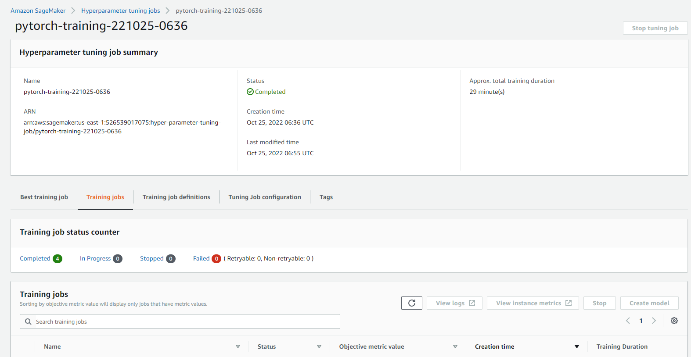
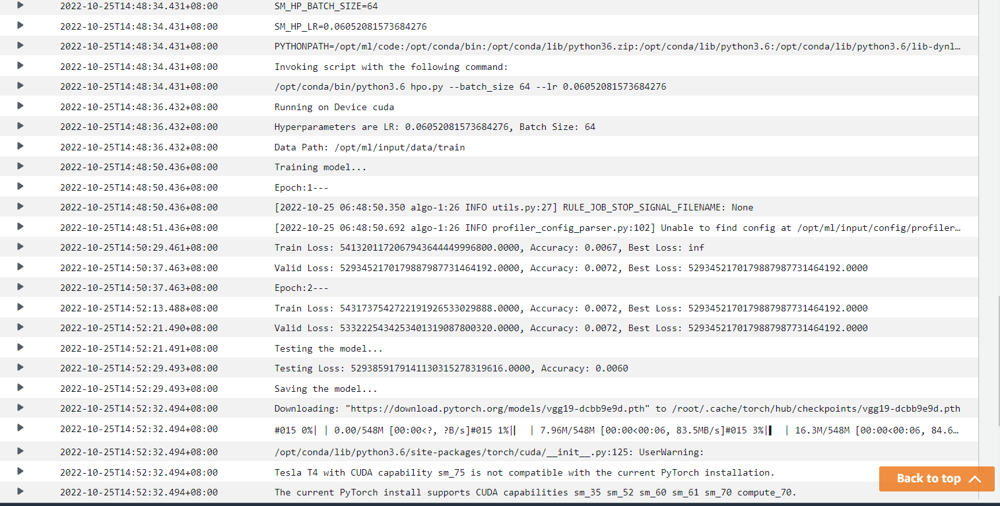
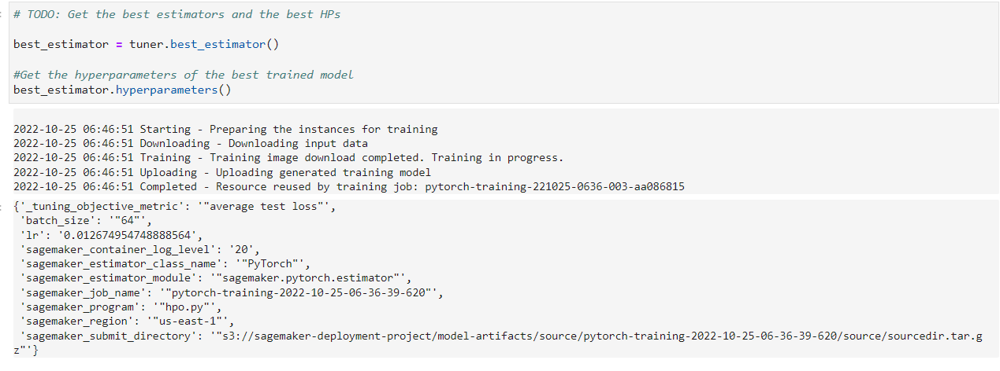
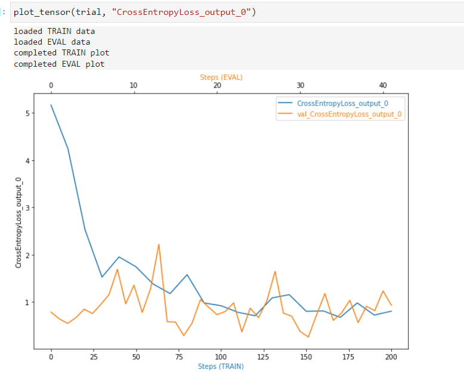
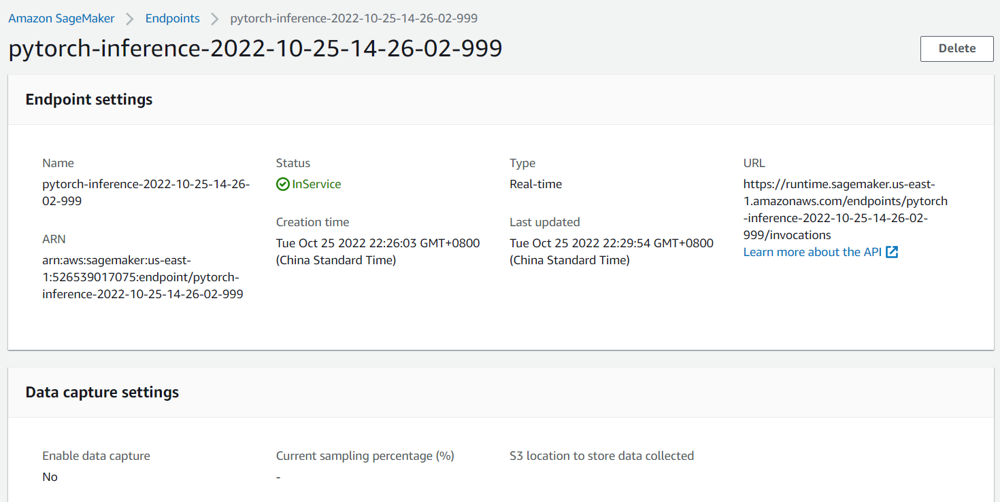
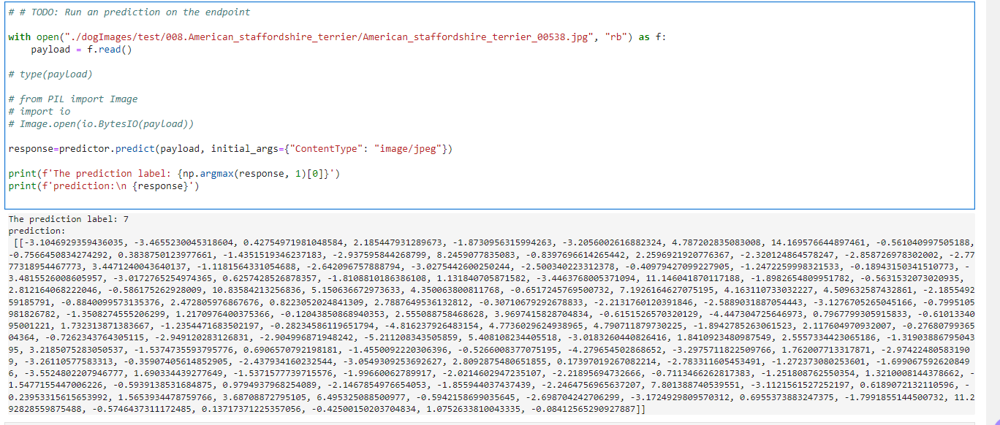

# Image Classification using AWS SageMaker
This project uses the dog breed classification data set to train a pretrained model for image classification called vgg19 using AWS Sagemaker profiling, debugger, hyperparameter tuning, etc.

## Project Set Up and Installation
Enter AWS through the gateway in the course and open SageMaker Studio. 
Download the [starter files](https://github.com/udacity/CD0387-deep-learning-topics-within-computer-vision-nlp-project-starter).
Download/Make the dataset available. 

## Dataset
[Dog Breed Classification Dataset](https://s3-us-west-1.amazonaws.com/udacity-aind/dog-project/dogImages.zip).


### Access
You can download the data for [dog breed](https://s3-us-west-1.amazonaws.com/udacity-aind/dog-project/dogImages.zip), unzip the files and upload it to an S3 bucket so that SageMaker has access to the data. 

## Script Files used

1. `hpo.py` for hyperparameter tuning jobs where we train the model for multiple time with different hyperparameters and search for the best one based on loss metrics.
2. `train_model.py` for really training the model with the best parameters getting from the previous tuning jobs, and put debug and profiler hooks for debugging purpose.
3. `inference.py` to using the trained model as inference and post-processing and serializing the data before it passes to the endpoint for prediction.
4. `train_and_deploy.ipynb` is a submission script that can create Hyperparameter Tuning job, Training job and Endpoints.

## Hyperparameter Tuning
I choose the VGG19 for this experiment since it is an advanced CNN with pre-trained layers and a great understanding of what defines an image in terms of shape, color, and structure.  




Below is the metrics during the training process in log file for the best estimator:



We select `lr` and `batch_size` as the hyperparameters: 

```
hyperparameter_ranges = {
    "lr": ContinuousParameter(0.001, 0.1),
    "batch_size": CategoricalParameter([32, 64, 128]),
}
```

Below is the best hyperparameters from all the training jobs:

```
best_hyperparameters={
    'lr': 0.012674954748888564,
    'batch_size': 64,
}
```



## Debugging and Profiling
We set the Debugger Hook to visualize the Loss Criterion of the process in both training and validation/testing. The Plot of the *Cross Entropy Loss* is shown below:



Profiling report see in `profiler-report.html`.

### Results
The CrossEntropyLoss_output_0 during training decreases and the  val_CrossEntropyLoss_output_0 doesn't increase, so no overfitting recorded.

During our training job, the LowGPUUtilization rule was the most frequently triggered. It processed 1068 datapoints and was triggered 4 times.


## Model Deployment
We use a separate script for inference in `inference.py` which implements the `model_fn`, `input_fn` and `predict_fn`. In `input_fn`, we only accept `image/jpeg` and `application/json` two types of content_type for the request. Model was deployed to a "ml.g4dn.xlarge" instance type.

How to query the endpoint with a sample image:

```
# open an image as bytetype object  
with open("./dogImages/test/008.American_staffordshire_terrier/American_staffordshire_terrier_00538.jpg", "rb") as f:
    payload = f.read()
# pass it to the endpoint 
response=predictor.predict(payload, initial_args={"ContentType": "image/jpeg"})

print(f'The prediction label: {np.argmax(response, 1)[0]}')
print(f'prediction:\n {response}')

```


Below is the endpoint we deployed:



Prediction result with sample image:


